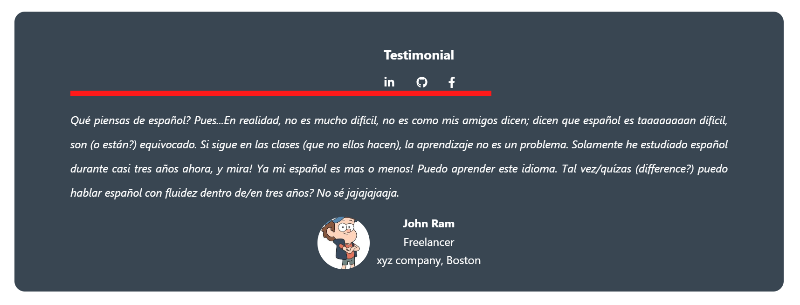

Install A "React Testimonial component" directly into your react-app , stop wasting your time fighting CSS with React. 

Features:
-Clickable LinkedIn , GitHub, Facebook icons
-Progress Bar
-Image support

## Installation

npm way!

### `npm i react-recommendation-container`

## Usage

Import the component

### `import TestimonialsContainer from "react-recommendation-container";`

And the component is ready to be used!

